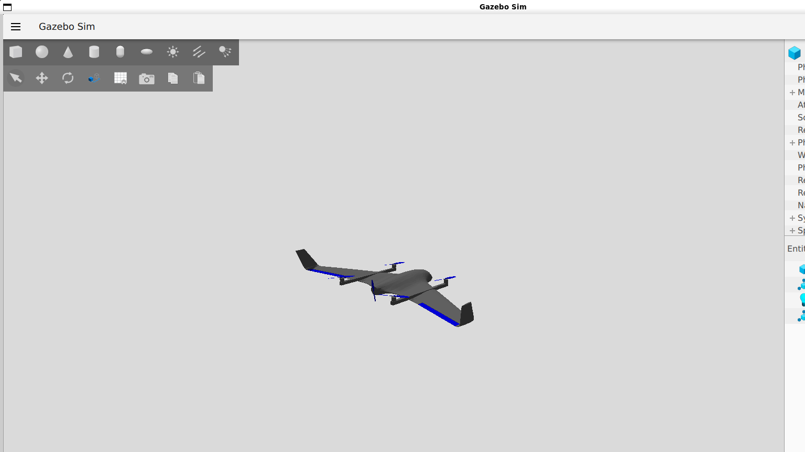
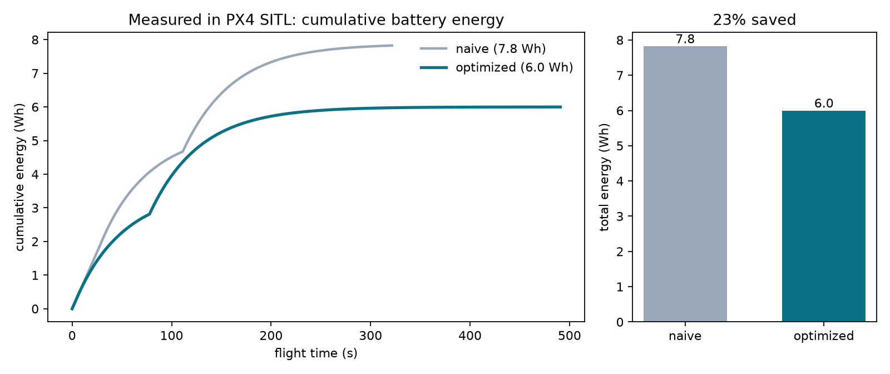
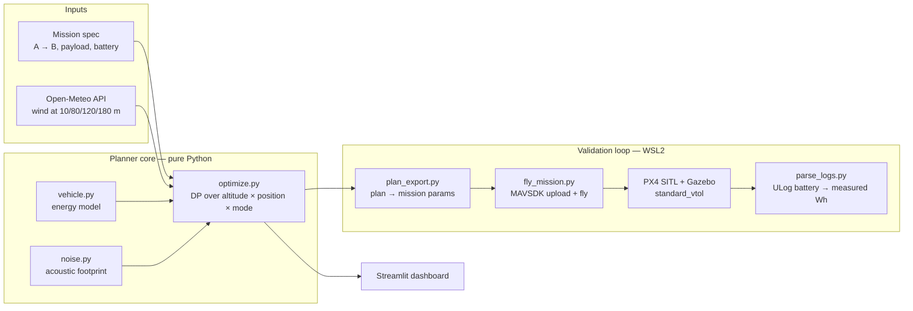
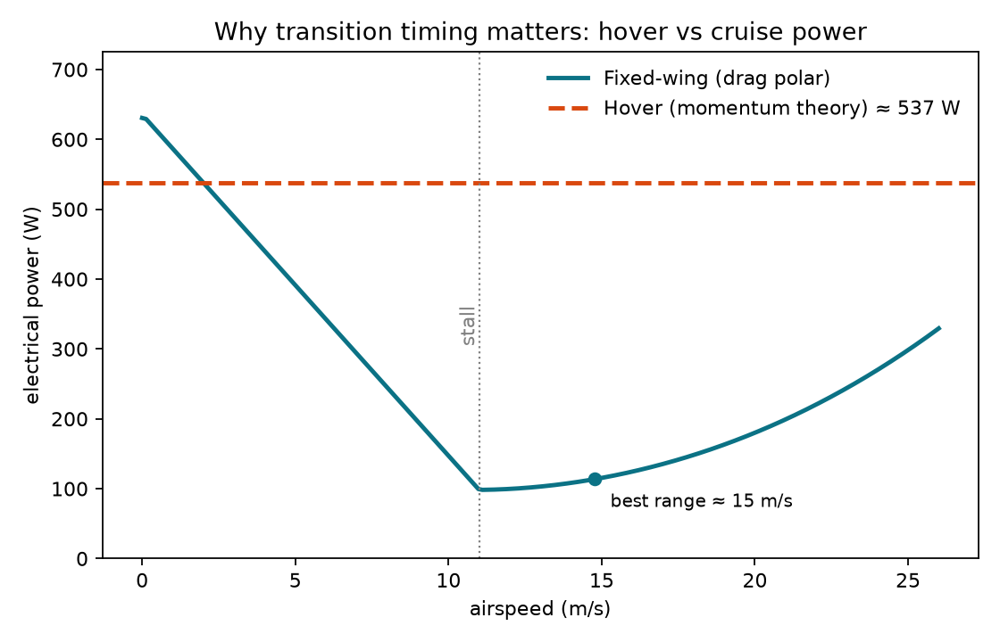
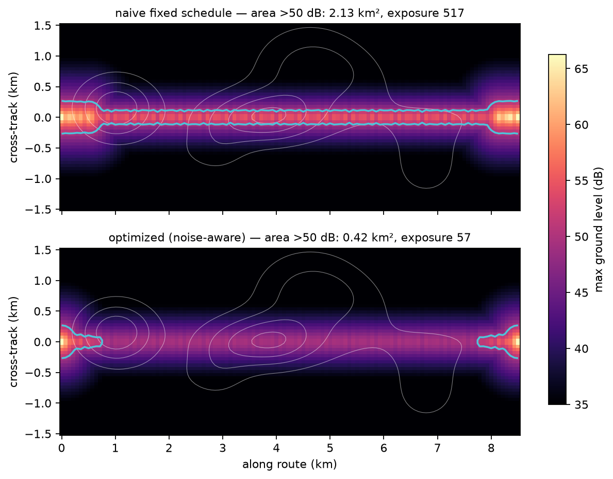
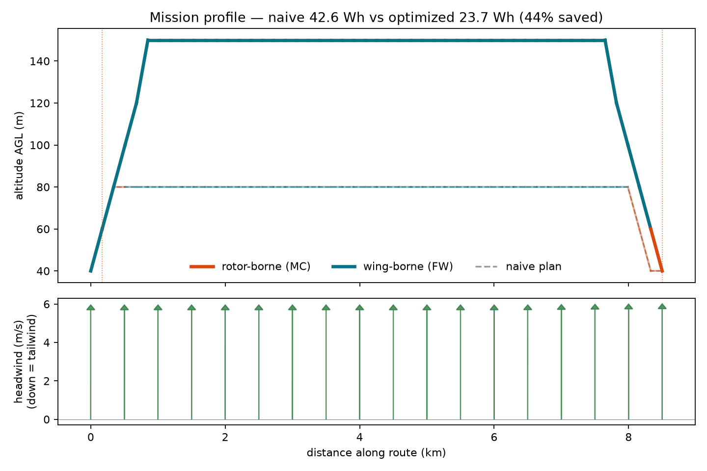
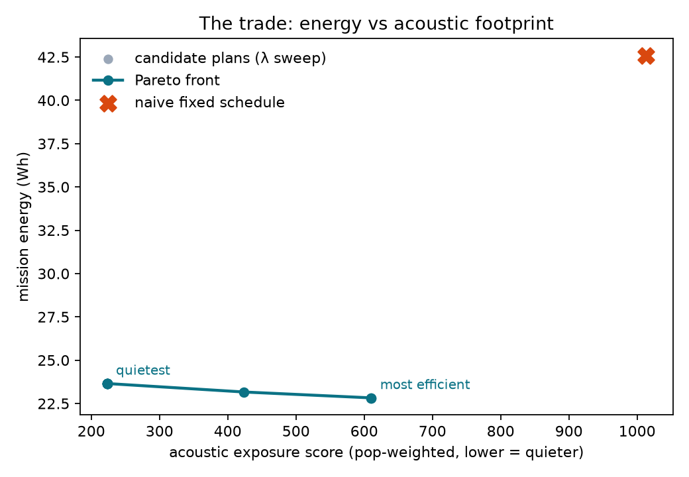
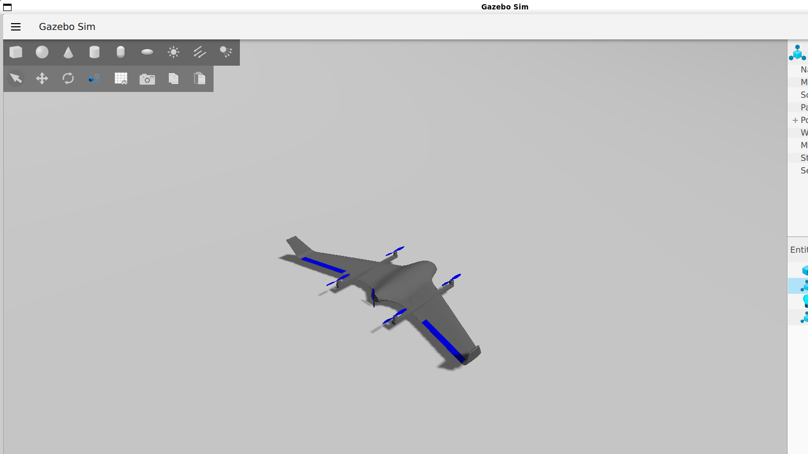
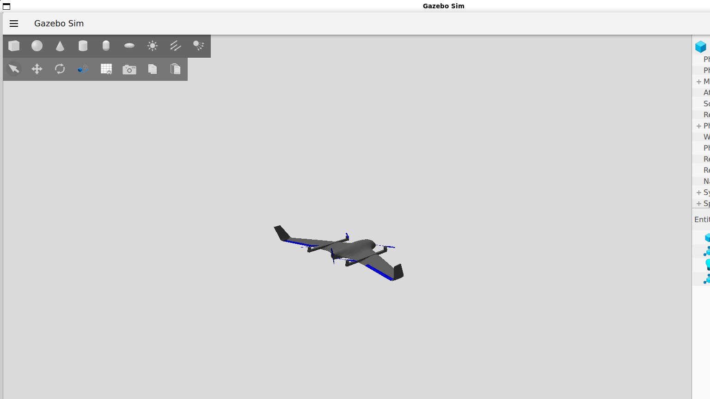

# Energy-Optimal VTOL Transition Planner

**When should a VTOL aircraft stop hovering and start flying like a plane?**
This project answers that question with real physics, real forecast wind, a real
autopilot — and treats *noise over people's heads* as a first-class objective,
because noise is the actual regulatory blocker for urban electric aviation.




---

## Headline results

| Metric | Naive fixed schedule | Optimized plan | Improvement |
|---|---|---|---|
| **Mission energy (measured in PX4 SITL)** | 7.8 Wh | **6.0 Wh** | **−23%** |
| Mission energy (planner, 8.5 km demo route) | 42.6 Wh | 23.7 Wh | −44% |
| Ground area louder than 50 dB | 2.13 km² | **0.42 km²** | **−80%** |
| Population-weighted noise exposure | 1013 | 223 | −78% |

The 23% is not a model grading its own homework: both plans were **flown by the
PX4 autopilot in software-in-the-loop simulation** (the same flight code that
flies real aircraft) and energy was integrated from the flight logs'
battery telemetry.



---

## The idea in 60 seconds

Almost every open-source AI-drone project targets multirotors. The genuinely
hard regime of real electric aviation is the **VTOL transition** — the handover
between rotor-borne hover and wing-borne cruise — and in practice it is still
flown on **fixed, hand-tuned schedules** ("climb to 80 m, transition at
waypoint 2, done").

That schedule is an optimization variable, and it matters enormously:

- **Hover burns ~4–10× cruise power.** For our 5 kg quadplane: ~537 W rotor-borne
  vs ~125 W wing-borne at 16 m/s. Every second of unnecessary hover is pure waste.
- **Hover is the loud mode.** A transition executed low over a neighborhood
  produces a dramatically larger noise footprint than one executed high or
  a few hundred meters later.
- **Wind changes the answer daily.** Wind speed and direction vary with
  altitude; the energy-per-ground-kilometer of cruise depends directly on the
  headwind at the chosen cruise altitude.

So the planner takes a mission (A → B, payload, battery), pulls **today's
forecast wind at multiple altitudes**, and searches every combination of
altitude, position, and flight mode for the plan that minimizes energy — with
acoustic footprint as a tunable second objective. Every plan is then **flown in
PX4 SITL** to check the physics against a real autopilot.

---

## Architecture



---

## Detailed analysis

### 1. Vehicle energy model (`planner/vehicle.py`)

Point-mass physics for a PX4 `standard_vtol`-class quadplane (5 kg, 4 lift
rotors of 0.17 m radius, 0.45 m² wing):

- **Hover — momentum theory.** Ideal power `P = W^1.5 / √(2ρA)` degraded by a
  figure of merit (0.70): **≈ 537 W** at 50 m. Air density follows the ISA
  atmosphere, so hover gets slightly cheaper as density falls.
- **Cruise — drag polar.** `P = D·V/η` with `CD = CD₀ + k·CL²` (CD₀ = 0.045,
  Oswald e = 0.85, AR = 6.5, prop η = 0.75): **≈ 125 W** at the best-range
  airspeed of ~16 m/s. Below stall (11 m/s) the model blends toward hover cost —
  the wing physically cannot carry the weight.
- **Transition — the expensive burst.** Both propulsion sets run for ~12 s at
  1.25× hover power: **≈ 2.2 Wh per transition event**. This is why you can't
  transition arbitrarily often, and why *where* you spend it matters.
- **Climb** costs potential energy at 65% conversion efficiency; descent
  recovers nothing (conservative).



*The whole project in one figure: the hover line towers over the cruise
U-curve. The planner's job is to spend as little time as possible on the
dashed line, as cheaply and quietly as possible.*

### 2. Real wind at altitude (`planner/wind.py`)

- Live **Open-Meteo forecast** (free, no key): wind speed & direction at
  10 / 80 / 120 / 180 m AGL, sampled at 5 points along the route.
- Log-profile extrapolation above 180 m (standard surface-layer practice).
- Responses are **cached to disk**, so the demo works offline.
- The optimizer sees wind as a headwind component per (position, altitude):
  ground speed = airspeed − headwind, so energy-per-ground-km rises directly
  with headwind at the chosen cruise altitude. **The optimal plan is different
  on different days** — that's the point.

### 3. Acoustic footprint (`planner/noise.py`)

First-order but honest, with every assumption exposed as a parameter:

- Per-mode source levels (dB re 20 µPa at 1 m): hover **100**, transition
  **106** (both prop sets at max), cruise **94** — ballparked from small-eVTOL
  noise literature.
- Propagation: spherical spreading (−20·log₁₀ r) plus atmospheric absorption
  (0.005 dB/m).
- A synthetic population-density grid (Gaussian "neighborhoods" + a suburban
  corridor under the route) — swappable for real census data.
- Score = population-weighted exceedance above a **50 dB** ground-level
  threshold (WHO-style quiet-suburb figure).



*Same mission, same aircraft. The naive plan drags a >50 dB carpet over the
whole route (2.13 km²); the optimized plan shrinks it to the two unavoidable
vertical-flight endpoints (0.42 km²).*

### 4. The optimizer (`planner/optimize.py`)

- **State space:** route discretized into 50 steps × 8 altitude levels
  (40–220 m) × 2 modes (rotor-borne / wing-borne) ≈ 800 states.
- **Edges:** advance one step while holding/climbing/descending one level,
  optionally switching mode (which prices the transition burst + its noise).
- **Search:** exact dynamic programming, edge cost = `energy + λ·noise`.
  Solves in milliseconds.
- **Pareto front:** sweeping λ from 0 → 3 produces the honest menu of trades —
  the most efficient plan, the quietest plan, and every non-dominated point
  between. The demo's middle point buys **63% less noise exposure for +0.9 Wh
  (+4%)** — noise-aware planning is nearly free, which is itself the insight.

Sanity behaviors observed (not hard-coded): with a tailwind aloft it
transitions early and rides the wind; with the noise weight raised it climbs
higher *before* going loud and shifts the transition away from dense cells.




### 5. SITL validation — the part that keeps us honest

Both the naive schedule and the optimizer's plan were converted into real PX4
missions (explicit `DO_VTOL_TRANSITION` commands at the planned distances,
planned cruise altitude) and flown by **PX4 SITL with the Gazebo `standard_vtol`
airframe** — vertical takeoff, transition, 2 km cruise, back-transition,
vertical landing:

| | transition out | back-transition | cruise altitude |
|---|---|---|---|
| Naive | 200 m | 1800 m | 80 m |
| Optimized (today's wind) | 40 m | 1850 m | 150 m |

Energy was integrated from the ULog battery telemetry (`V × I dt`),
takeoff → touchdown. Result: **7.8 Wh naive vs 6.0 Wh optimized — 23% saved.**
The mechanism is visible in the cumulative-energy curves: the naive plan's
long rotor-borne segments produce a steep burn the optimized plan simply
doesn't have.




---

## Run it

**Planner + dashboard :**

```bash
pip install -r requirements.txt
python -m planner.make_figures      # regenerates figures 04–07 with today's wind
streamlit run app/dashboard.py      # interactive demo on localhost:8501
```

**SITL validation loop (Linux/WSL2 with PX4 + Gazebo installed):**

```bash
# terminal 1: the simulator
cd ~/PX4-Autopilot && make px4_sitl gz_standard_vtol

# terminal 2: solve with today's wind, fly both plans, build the chart
python3 -m sitl.plan_export
python3 sitl/fly_mission.py --plan naive
python3 sitl/fly_mission.py --plan optimized
python3 sitl/parse_logs.py data/logs/naive.ulg data/logs/optimized.ulg
```

---

## Honest limitations

1. **Two validated links, not one closed loop.** Plans are optimized against
   real *forecast* wind; energy is validated against PX4 SITL, whose wind is a
   simple simulator parameter rather than the forecast field. We state both
   links separately and never claim the merged version.
2. **Absolute vs relative numbers.** The SITL route is a scaled-down 2 km lap
   (sim time is real time — an 8.5 km lap per experiment was impractical for a
   hackathon), so planner Wh and SITL Wh are not directly comparable; the
   *ranking and mechanism* (less rotor-borne time → large savings) is what the
   experiment validates. Calibrating the analytic model's constants from these
   same logs is the natural next step.
3. **First-order acoustics.** Per-mode source levels + spherical spreading +
   synthetic population. No directivity, no ground reflection, no real census
   layer — all four are drop-in upgrades, none change the architecture.
4. **Touchdown artifact.** The current Gazebo build occasionally lets the
   model clip through terrain at touchdown; logs are therefore integrated
   takeoff → touchdown (standard practice anyway).

## Why not reinforcement learning?

The discretized problem (~800 states) is solved *optimally* in milliseconds by
dynamic programming — RL would be slower, approximate, and un-debuggable in a
weekend. Learning belongs where the physics is weakest: replacing the analytic
power model with one **fit from these same SITL flight logs** is the roadmap's
next tier, and slots into the planner as a drop-in function.

## Roadmap

- [ ] Power model learned from batch SITL flights (drop-in replacement for `vehicle.py`)
- [ ] Forecast wind injected into the Gazebo world (closes limitation #1)
- [ ] Real population raster (WorldPop/GHSL) under the noise grid
- [ ] Battery-aware feasibility margins + reserve constraints

## Repository

```
planner/          energy model · wind · noise · DP optimizer · figure generator
sitl/             plan export · MAVSDK mission flyer · ULog energy parser
app/dashboard.py  Streamlit demo (map, Pareto slider, live wind)
figures/          all pitch figures + full photo-flight frame burst
data/logs/        the actual ULog flight logs behind the 23% claim
```

---


